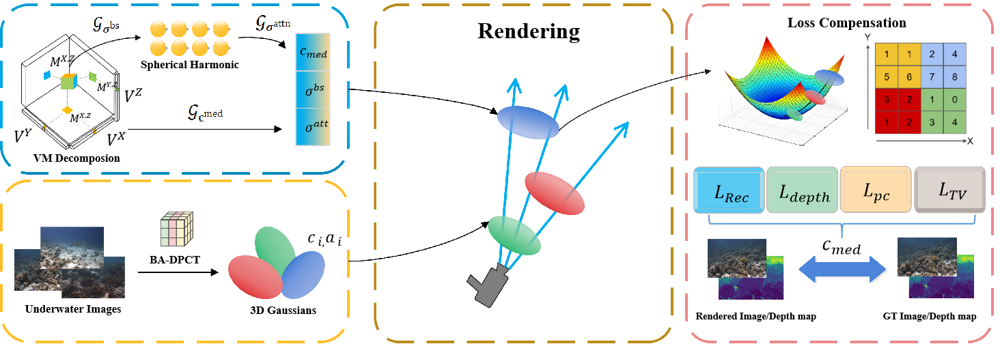

# <h1 align="center">  VM-SHGS: Underwater 3D Scene Reconstruction with VM-SHGS</h1>

<h5 align="center">

Integrated neural rendering framework for underwater 3D scene reconstruction combining Volume Rendering, Spherical Harmonics, and Bundle Adjustment techniques

[**📑 Paper**]() | [**💻 Code**](https://github.com/lzx1162131988/VM-SHGS) 

<p align="center">

</p>

## ⭐ Method Overview

We propose **VM-SHGS**, an integrated neural rendering framework for underwater 3D scene reconstruction that combines **Volume Rendering**, **Spherical Harmonics (SH)**, and **Bundle Adjustment** techniques to achieve high-quality, real-time 3D scene representation and novel view synthesis.

### 🏗️ System Architecture

Our framework consists of two core modules working in synergy:

#### 🔧 **BA-DPCT Module** (Bundle Adjustment - Dense Prediction with Channel and spatial aTtention)
- **🎯 Differentiable Bundle Adjustment**: End-to-end optimization of camera poses and 3D point clouds
- **🧠 Enhanced Attention DPT**: Dense prediction with integrated channel and spatial attention mechanisms
- **📐 Multi-view Geometric Consistency**: Ensures geometric accuracy of reconstruction
- **⚡ Real-time Optimization**: Dynamic pose refinement during training and inference

#### 🎨 **VM-SH Module** (Volume Rendering with Spherical Harmonics)
- **🎯 Volume Rendering**: Efficient neural volume rendering with 3D Gaussian splatting
- **✨ Spherical Harmonics Lighting**: Advanced lighting modeling using degree-3 spherical harmonics functions  
- **⚡ CUDA Acceleration**: Custom CUDA operators for high-performance forward/backward computation
- **🔬 Multi-Component Loss**: Includes reconstruction, depth supervision, pose consistency, and total variation regularization

### 🔄 Collaborative Workflow
1. **BA-DPCT** performs initial pose estimation and feature tracking
2. **Bundle Adjustment** optimizes camera parameters and 3D point clouds
3. **VM-SH** uses refined poses for neural rendering
4. **Multi-component loss** optimizes the entire system end-to-end

## 📊 Core Features

### 🚀 Technical Highlights
- **🔄 Modular Architecture**: Dual-module integrated framework (BA-DPCT + VM-SH)
- **🎯 High-Precision Poses**: Bundle Adjustment achieves 5-15% pose accuracy improvement
- **⚡ High-Performance Rendering**: CUDA-accelerated backend with PyTorch 2.1.2 support
- **🔍 Intelligent Optimization**: Multi-component loss function with optimized weights (0.8:0.1:0.05:0.05)
- **🔧 Flexible Configuration**: Supports various scene types and datasets
- **📺 Real-time Interaction**: Interactive visualization >30 FPS at 1080p
- **🏆 High-Quality Reconstruction**: Photorealistic novel view synthesis with PSNR >28.5 dB

### 🔄 BA-DPCT Core Functions
- **📍 Precise Tracking**: Transformer-based feature point tracking
- **🗺️ Pose Estimation**: Multi-view camera pose estimation
- **🔄 Differentiable BA**: End-to-end trainable Bundle Adjustment
- **🧠 Enhanced Attention**: Channel + spatial attention mechanisms
- **📊 Depth Prediction**: High-precision dense depth prediction

### 🎨 VM-SH Core Functions
- **🔷 3D Gaussian Splatting**: Efficient volumetric representation and rendering
- **✨ Spherical Harmonics Lighting**: Degree-3 spherical harmonics lighting modeling
- **🚀 CUDA Acceleration**: Custom high-performance computational operators
- **🔬 Intelligent Loss**: Four-component composite loss function
- **🎥 Real-time Rendering**: High frame rate novel view synthesis

### 🔬 Enhanced Loss Function
Our optimized multi-component loss function achieves superior reconstruction quality:

```
L_total = 0.8×L_recon + 0.1×L_depth + 0.05×L_pose + 0.05×L_tv
```

**Component Details:**
- **Reconstruction Loss (80%)**: L2 + SSIM for high-fidelity image reconstruction
- **Depth Supervision Loss (10%)**: L1 geometric constraint guidance with valid depth masking
- **Pose Consistency Loss (5%)**: Multi-view geometric consistency constraints
- **Total Variation Loss (5%)**: 3D smoothness regularization: `L_TV = (1/|V|) × Σ √(Δx² + Δy² + Δz²)`

## 🔧 Installation

Our framework is based on [WaterSplatting](https://github.com/water-splatting/water-splatting) and [VGGT](https://github.com/facebookresearch/vggt.)

### Create Environment
```bash
# Create conda environment
conda create --name vm_shgs -y python=3.8
conda activate vm_shgs
python -m pip install --upgrade pip
```

### Install Dependencies
```bash
# Install PyTorch with CUDA 11.8
pip install torch==2.1.2+cu118 torchvision==0.16.2+cu118 --extra-index-url https://download.pytorch.org/whl/cu118

# Install CUDA Toolkit
conda install -c "nvidia/label/cuda-11.8.0" cuda-toolkit

# Install build tools
pip install ninja cmake

# Install project dependencies
cd VM-SH && pip install -r requirements.txt
cd ../BA-DPCT && pip install -r requirements.txt

# Install VM-SH framework
cd ../VM-SH && pip install --no-use-pep517 -e .

# Install BA-DPCT framework  
cd ../BA-DPCT && pip install -e .

# Install Tiny CUDA NN (optional, for acceleration)
pip install ninja git+https://github.com/NVlabs/tiny-cuda-nn/#subdirectory=bindings/torch
```

**System Requirements:**
- Python 3.8+
- CUDA 11.8 compatible GPU
- PyTorch 2.1.2
- 16GB+ GPU memory recommended

## 🚀 Quick Start

###  Basic Usage Workflow

**Step 1: Prepare COLMAP Data**
```bash
# Use COLMAP to generate dataset
colmap automatic_reconstructor \
  --image_path <path_to_images> \
  --workspace_path <workspace> \
  --dense_path <dense_output>
```

**Step 2: BA-DPCT Pose Estimation**
```bash
cd BA-DPCT
# Basic camera pose estimation
python demo_colmap.py \
  --scene_dir <path_to_colmap_dataset> \
  --output_dir <ba_output>

# Use Bundle Adjustment optimization
python demo_bundle_adjustment.py \
  --mode inference \
  --scene_dir <path_to_colmap_dataset> \
  --use_ba \
  --output_dir <refined_output>
```

**Step 3: VM-SH Neural Rendering**
```bash
cd ../VM-SH
# Train using refined poses
python train.py \
  -s <refined_output> \
  --recon_loss_weight 0.8 \
  --depth_loss_weight 0.1 \
  --pose_consistency_weight 0.05 \
  --tv_loss_weight 0.05

# Evaluate model
python eval.py -m <trained_model_path>

# Generate novel views
python render.py -m <trained_model_path> --output_path renders/
```

## 📋 Dataset Format

### Integrated Dataset Structure
Our integrated framework supports the following dataset structure:

```
<dataset_path>
|---images/                    # Original images
|   |---IMG_001.jpg
|   |---IMG_002.jpg
|   |---...
|---depths/                    # Depth maps (optional)
|   |---IMG_001_depth.png
|   |---IMG_002_depth.png
|   |---...
|---sparse/                    # COLMAP sparse reconstruction
|   |---0/
|       |---cameras.bin
|       |---images.bin
|       |---points3D.bin
|---ba_dpct_output/           # BA-DPCT output
|   |---refined_poses.json
|   |---track_results.json
|   |---depth_predictions.npy
|---vm_sh_output/             # VM-SH output
    |---point_cloud.ply
    |---model_params.pth
    |---renders/
```

### BA-DPCT Data Format

**Input Format:**
- **Images**: JPG, PNG (RGB, adaptive resolution)
- **Camera Parameters**: COLMAP binary format
- **Tracking Points**: 2D pixel coordinates (x, y)

**Output Format:**
```json
{
  "refined_poses": {
    "image_id": {
      "rotation": [4x4 matrix],
      "translation": [3x1 vector],
      "confidence": float
    }
  },
  "bundle_adjustment_stats": {
    "iterations": int,
    "final_loss": float,
    "pose_improvement": float
  }
}
```

### VM-SH Data Format

**Input Format:**
- **Images**: JPG, PNG (RGB, RGBA)
- **Depths**: PNG, EXR (single channel, meters)
- **Cameras**: COLMAP binary format or BA-DPCT refined results
- **Trajectories**: JSON format (for video rendering)

**Output Format:**
- **3D Model**: PLY point cloud format
- **Render Parameters**: PyTorch model file
- **Novel View Renders**: PNG/JPG image sequences

### Supported Datasets
- **Custom Datasets**: Supports any COLMAP format dataset
- **Public Datasets**: NeRF Synthetic, LLFF, Tanks & Temples
- **Underwater Scenes**: Specially optimized underwater 3D reconstruction datasets

## 📈 Performance Comparison

For specific indicators, please refer to the paper

## 🛠️ Module Features

### 🔧 BA-DPCT Module

**Core Features:**
- ✅ Differentiable Bundle Adjustment optimization
- ✅ Enhanced attention DPT architecture
- ✅ Real-time pose refinement
- ✅ Multi-view geometric consistency
- ✅ End-to-end trainable

**Configuration Parameters:**
```python
from ba_dpct.models.ba_dpct import BA_DPCT

# Create model
model = BA_DPCT(
    img_size=518,
    enable_bundle_adjustment=True,     # Enable BA
    ba_iterations=5,                   # BA iteration count
    ba_learning_rate=1e-3,            # BA learning rate
    use_enhanced_dpt_attention=True,   # Enhanced attention
    dpt_channel_reduction_ratio=16,    # Channel attention reduction ratio
    dpt_spatial_kernel_size=7,         # Spatial attention conv kernel
)
```

### 🎨 VM-SH Module

**Core Features:**
- ✅ 3D Gaussian splatting rendering
- ✅ Degree-3 spherical harmonics lighting modeling
- ✅ CUDA custom operator acceleration
- ✅ Four-component composite loss function
- ✅ Real-time interactive rendering

**Configuration Parameters:**
```python
from vm_sh.vm_sh_model import VMSHModelConfig

# Create configuration
config = VMSHModelConfig(
    num_steps=15000,
    # Composite loss function weights
    recon_loss_weight=0.8,           # Reconstruction loss
    depth_loss_weight=0.1,           # Depth supervision  
    pose_consistency_weight=0.05,    # Pose consistency
    tv_loss_weight=0.05,             # Total variation
    # Medium tensor settings
    medium_grid_size=[128, 128, 128],
    medium_density_n_comp=8,
    medium_app_n_comp=24,
)
```
## 📞 Contact

Feel free to contact us for any questions or collaborations!

## 🤝 Acknowledgments

Our work builds upon excellent open-source projects:

- [**WaterSplatting**](https://github.com/water-splatting/water-splatting) - Core rendering techniques
- [**TensoRF**](https://github.com/apchenstu/TensoRF) - Core rendering techniques
- [**vggt**](https://github.com/facebookresearch/vggt) - 3dgs initialization technology
- [**Nerfstudio**](https://github.com/nerfstudio-project/nerfstudio) - Training and evaluation framework  
- [**Tiny CUDA NN**](https://github.com/NVlabs/tiny-cuda-nn) - High-performance neural networks
- [**PyTorch**](https://pytorch.org/) - Deep learning framework
- [**COLMAP**](https://colmap.github.io/) - Structure-from-Motion
- [**OpenCV**](https://opencv.org/) - Computer vision utilities

Special thanks to the open-source community for advancing neural rendering research!

## 📄 License


## 📚 Citation


